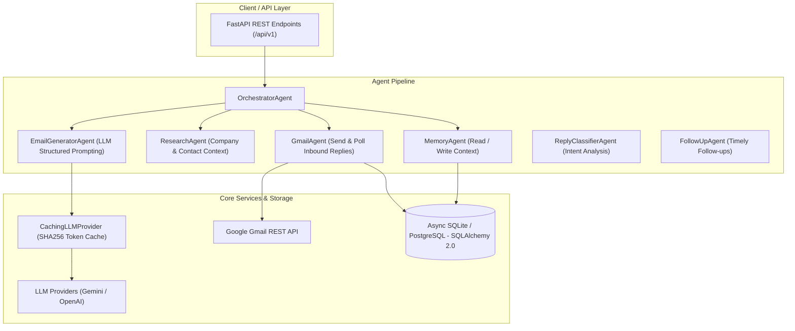

# 🚀 Autonomous AI Job Outreach Agent

An enterprise-grade, multi-agent AI system built to automate, personalize, and orchestrate cold job outreach at scale. Built with **FastAPI**, **Async SQLAlchemy 2.0**, **Google Gemini 3.6 Flash / OpenAI GPT-4o**, and **Gmail API**.

---

## 🎯 Problem & Solution

### The Problem
- **Manual Outreach is Slow & Disjointed**: Job seekers spend hours manually researching companies, finding contacts, drafting customized emails, and manually tracking sent threads in spreadsheets.
- **Generic Templates Get Ignored**: Recruiter and hiring manager inboxes are flooded with generic, copy-pasted cold emails that lack real personalization or relevance.
- **Missed Follow-Ups**: Over 70% of responses come from timely follow-up emails, yet job seekers frequently forget to follow up or lose track of conversation states across multiple threads.

### The Solution
The **AI Job Outreach Agent** automates the entire outreach workflow autonomously:
1. **Context-Aware Personalization**: Generates highly relevant, non-spammy cold emails tailored specifically to the target contact, company description, industry, and job role.
2. **Multi-Agent Orchestration**: Decoupled AI agents handle memory loading, company research, prompt compilation, Gmail sending, thread tracking, and reply classification.
3. **Automated Gmail Integration**: Direct REST API integration with Gmail OAuth2 for sending, inbox polling, and conversation state management.
4. **Token Cost Optimization**: Built-in SHA256 prompt caching avoids redundant LLM generations and optimizes API token usage.

---

## 🏗 System Architecture



---

## 🤖 Multi-Agent Ecosystem

| Agent | Responsibility | Output / Artifact |
| :--- | :--- | :--- |
| **`OrchestratorAgent`** | Pipeline execution, error isolation, context state routing | Standardized `AgentResult` |
| **`MemoryAgent`** | Reads prior interactions, stores outreach outcomes & preferences | Structured `agent_memory` DB records |
| **`ResearchAgent`** | Fetches and summarizes company/contact background context | Enriched context dictionary |
| **`EmailGeneratorAgent`** | Compiles structured Pydantic prompts & generates email drafts | `EmailGenerationOutput` (Subject, Body, Reasoning) |
| **`GmailAgent`** | Sends emails via OAuth2 API, polls inbox for inbound thread messages | Gmail Thread ID & persistent DB records |
| **`ReplyClassifierAgent`** | Classifies reply intent (`interested`, `not_interested`, `question`, `auto_reply`) | `ReplyClassificationOutput` with confidence score |
| **`FollowUpAgent`** | Generates non-pushy follow-ups for unreplied target outreach | `FollowUpOutput` draft |

---

## ⚙️ Tech Stack

- **Framework**: FastAPI, Pydantic v2, Pydantic-Settings
- **Database & ORM**: SQLAlchemy 2.0 (Async), SQLite (aiosqlite) / PostgreSQL (asyncpg)
- **AI Integrations**: Google Gemini 3.6 Flash (via `httpx`), OpenAI GPT-4o-mini
- **Email Service**: Google Gmail REST API via OAuth2
- **Testing**: `pytest`, `pytest-asyncio`, `httpx`

---

## 🚀 Quickstart Guide

### 1. Prerequisites
- Python 3.10+
- Google Gemini API Key (or OpenAI API Key)
- Google Cloud OAuth2 Client Credentials (`credentials.json` for Gmail)

### 2. Environment Setup

Clone the repository and install dependencies:
```bash
git clone https://github.com/RitikaJain8818/job-outreach-agent.git
cd job-outreach-agent

python3 -m venv .venv
source .venv/bin/activate
pip install -e .
```

Create a `.env` file in the root directory:
```env
APP_ENV=development
LOG_LEVEL=INFO

# Database
DATABASE_URL=sqlite+aiosqlite:///./data/dev.db

# LLM Configuration
LLM_PROVIDER=gemini
GEMINI_API_KEY=your_gemini_api_key_here
GEMINI_MODEL=gemini-3.6-flash

# Sender Identity
SENDER_NAME=Ritika Jain
SENDER_EMAIL=ritikajain49026@gmail.com
SENDER_BACKGROUND=Full Stack Engineer specializing in AI agents, Python, and scalable backend systems.
SENDER_TONE=professional
```

### 3. Gmail API Authorization

1. Place your Google Cloud OAuth2 client file as `credentials.json` in the root folder.
2. Run the authentication script:
   ```bash
   python scripts/gmail_auth.py
   ```
3. Authorize via your browser. This creates `token.json` for offline automated access.

### 4. Running the Application

Start the FastAPI application server:
```bash
uvicorn app.main:app --reload
```
Interactive API Docs will be available at: **http://127.0.0.1:8000/docs**

---

## 🧪 Testing & Execution

### Run Automated Unit & Integration Tests
```bash
pytest -v
```

### Send a Test Email
Test your Gmail connection with a sample email:
```bash
python scripts/test_send.py --to your_email@example.com
```

### Run End-to-End Outreach Pipeline
Test full AI generation and delivery:
```bash
python scripts/test_pipeline.py
```

---

## 🌐 API Overview

| Method | Endpoint | Description |
| :--- | :--- | :--- |
| `GET` | `/health` | Application health check & version info |
| `POST` | `/api/v1/companies` | Create a company profile |
| `GET` | `/api/v1/companies` | List registered companies |
| `POST` | `/api/v1/contacts` | Create a target contact |
| `GET` | `/api/v1/contacts` | List contacts with company associations |
| `POST` | `/api/v1/outreach/campaigns` | Create an outreach campaign |
| `POST` | `/api/v1/outreach/campaigns/{id}/targets` | Add contacts to campaign |
| `POST` | `/api/v1/outreach/campaigns/{id}/run` | Execute multi-agent campaign pipeline |

---

## 📄 License
Distributed under the MIT License.
